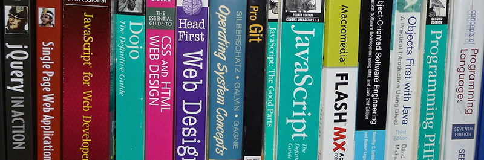

# Galvanize Reads



* Galvanize Reads is a [CRUD](https://en.wikipedia.org/wiki/Create,_read,_update_and_delete) app to track books and authors.
* The app our Q2 assessment for the [Galvanize Full Stack](http://www.galvanize.com/courses/web-development) program.
* Find it live on the web at: https://greads25.herokuapp.com

## Created By

Christopher Comella    
http://linkedin.com/in/comella

## Key Technologies Used

* [Node.js](https://nodejs.org)
* [Express](http://expressjs.com)
* [Knex.js](http://knexjs.org)
* [PostgreSQL](https://www.postgresql.org)

## Run It Locally

Assuming you have the required software on you computer and have it configured properly, you should be able to run the app on your machine with the following steps:

1. Create the database:
   - ````$ createdb greads````
2. Clone and install the app:
   - ````$ git clone git@github.com:chrisco/galvanize-reads.git````
   - ````$ cd galvanize-reads````
   - ````$ npm i````
3. Create the database tables:
   - ````$ knex migrate:latest````
4. Seed the database tables:
   - ````$ knex seed:run````
4. Start the server:
   - ````$ npm run dev-start````
2. Visit: [http://localhost:3000](http://localhost:3000)

## Sample Book to Insert
Eloquent JavaScript, 2nd Edition    

JavaScript    

Eloquent JavaScript, 2nd Edition dives deep into the JavaScript language to show you how to write beautiful, effective code. Author Marijn Haverbeke immerses you in example code from the start, while exercises and full-chapter projects give you hands-on experience with writing your own programs.    

http://eloquentjavascript.net/img/cover.png    
